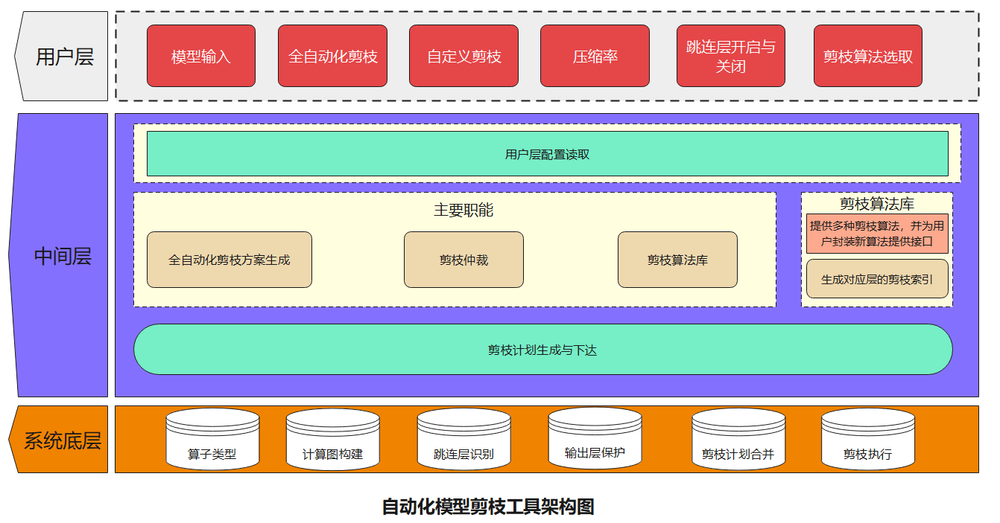
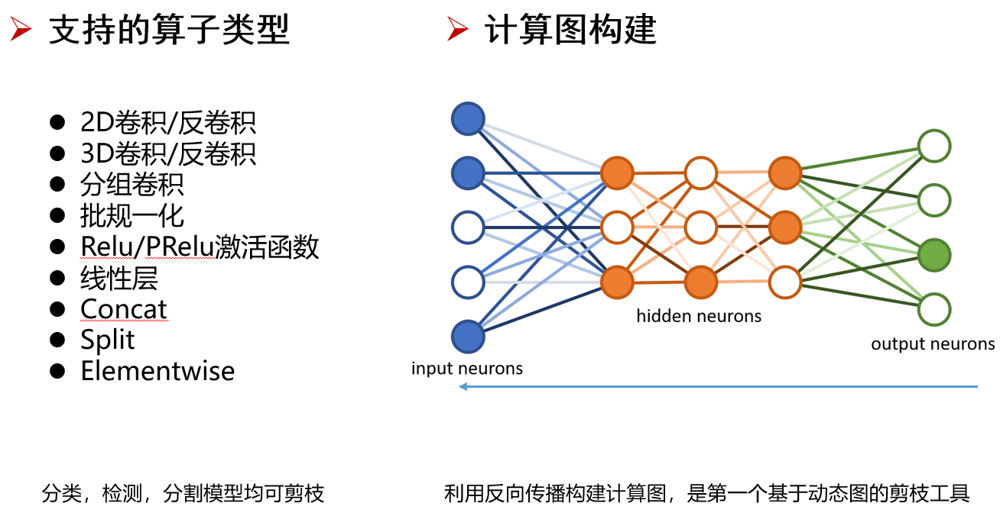
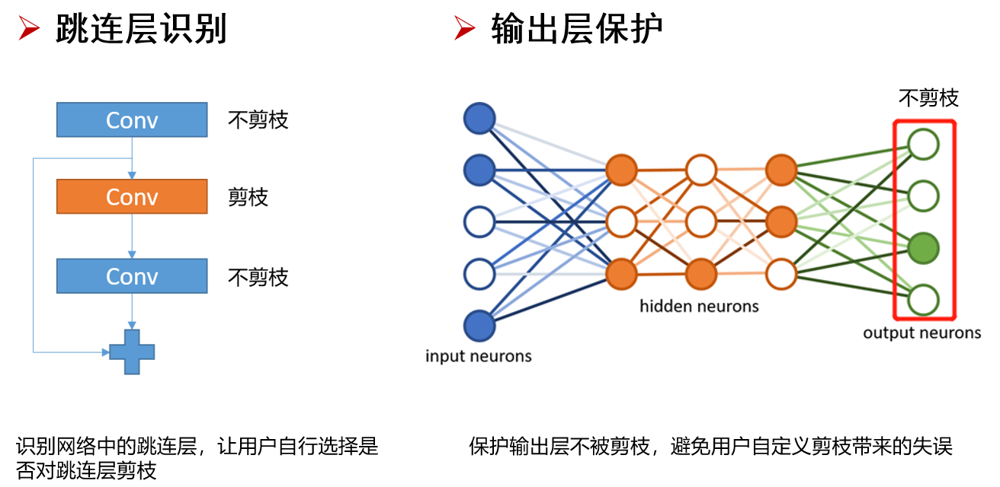

# Autoslim

A pytorch toolkit for structured neural network pruning automatically

完全自动化的模型剪枝工具
## 1 Introduction 项目介绍

### ① Architecture 系统架构



**用户层**：人人都会用的剪枝工具，仅需二行代码即可完成全自动化剪枝

**中间层**：提供统一接口，让开发者可以自己封装SOTA剪枝算法，不断更新工具

**系统底层**：自动分析网络结构并构建剪枝关系

### ② Features 特点





## 2 Support 支持度

### ① Supported Models 支持的模型

|模型类型|<center>支持</center>|<center>已测试</center> |
| --- | --- | --- |
| 分类模型 |√  |AlexNet,VGG，ResNet系列等  |
| 检测模型 |√  |CenterNet，YOLO系列等  |
| 分割模型 |√ | 正在测试 |

### ② Pruning Algorithm 剪枝算法

|函数名|<center>剪枝算法</center>|
| --- | --- |
| l1_norm_pruning |[Pruning Filters for Efficient ConvNets](https://arxiv.org/abs/1608.08710)|
| fpgm_pruning |[Filter Pruning via Geometric Median for Deep Convolutional Neural Networks Acceleration](https://arxiv.org/abs/1811.00250)|


在原始剪枝算法上，做了部分调整。此外，后续会支持更多的剪枝算法。
## 3 Installation 安装

```bash
pip install -e ./Autoslim
```

## 4 Instructions 使用介绍

**model可以来源于torchvision，也可以是自己在Pytorch中构建的model**

### 1 Automatic Pruning 自动化剪枝

```python
# 例子1:自动化剪枝

import torch_pruning as pruning
from torchvision.models import resnet18
import torch

#模型建立
model=resnet18()

#剪枝引擎建立
slim=pruning.Autoslim(model,inputs=torch.randn(1,3,224,224),compression_ratio=0.5)

#剪枝，系统默认prune_shortcut=1,prune_shortcut=0时不剪跳连层
slim.l1_norm_pruning(prune_shortcut=1)
```

### 2 Custom Pruning 自定义剪枝

```python
# 例子2:自定义剪枝

import torch_pruning as pruning
from torchvision.models import resnet18
import torch

#用户输入：模型，模型输入数据，自定义压缩率

#模型建立
model=resnet18()

#剪枝引擎建立
slim=pruning.Autoslim(model,inputs=torch.randn(1,3,224,224),compression_ratio=0.5)

#查看每个层的编号
for key,value in slim.index_of_layer().items():
  print(key,value)

#按照{层编号：层压缩率}这样的字典格式，指定自定义层的压缩率。其中1为层编号，0.6为层压缩率
layer_compression_rate={1:0.6}

#剪枝
slim.l1_norm_pruning(layer_compression_ratio=layer_compression_rate)
```

### 3 Save/Finetune 微调并保存

```python
# 例子3:微调并保存

import torch_pruning as pruning
from torchvision.models import resnet18
import torch

#模型建立
model=resnet18()

#剪枝引擎建立
slim=pruning.Autoslim(model,inputs=torch.randn(1,3,224,224),compression_ratio=0.5)

#剪枝，系统默认prune_shortcut=1,prune_shortcut=0时不剪跳连层
slim.l1_norm_pruning(prune_shortcut=1)

#使用自己的train函数，对剪枝后的model微调
train(model)

#微调后，保存模型
torch.save(model,'./resnet18.pth')

#如果需要再次载入模型，使用下面的语句
resnet18_pruned_model=torch.load('./resnet18.pth')

```

## 5 Examples 使用案例

### ①Resnet-cifar10

#### Train 训练

```bash
python prune_resnet18_cifar10.py --mode train --round 0
```
#### Pruning 剪枝

```bash
python prune_resnet18_cifar10.py --mode prune --round 1 --total_epochs 60
```
### ②Resnet-cifar100

#### Train 训练

```bash
python cifar100_prune.py --mode train --round 0 --total_epochs 200 --batch_size 512
```
#### Pruning 剪枝

```bash
python cifar100_prune.py --mode prune --round 1 --total_epochs 120 --batch_size 512
```

..........................................................................等等
